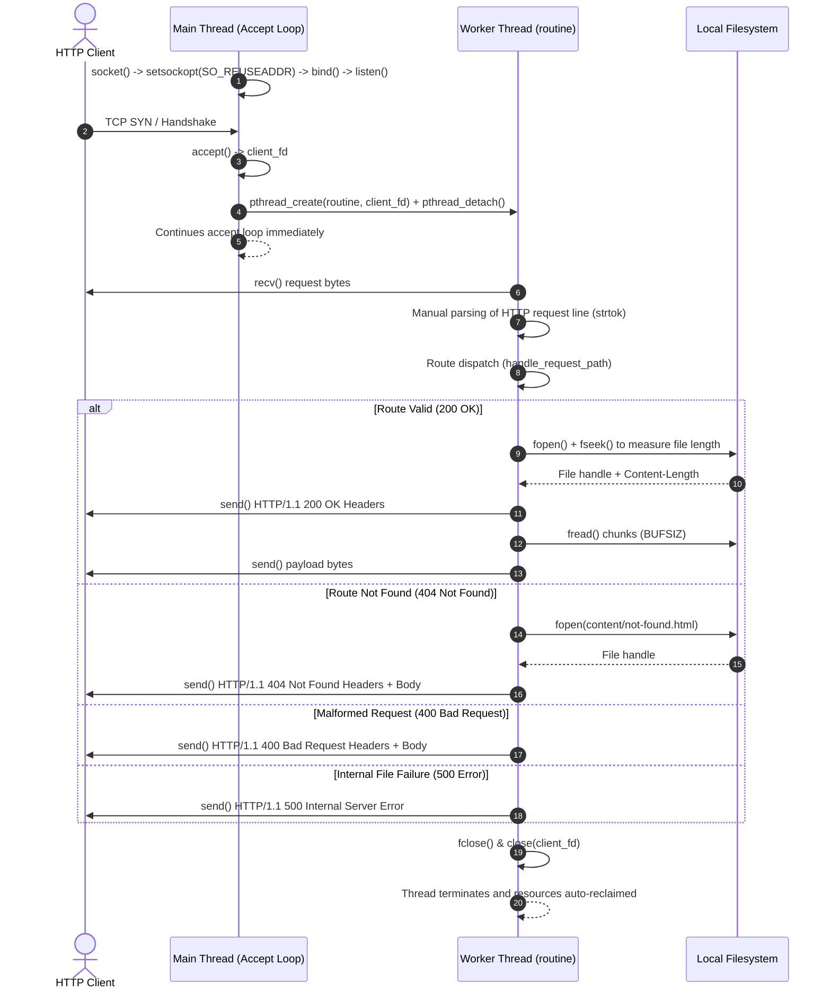

# sserver-c

Concurrent HTTP/1.1 static web server implemented in C23 using raw POSIX TCP sockets and pthreads.

## System Overview

`sserver-c` is a lightweight HTTP/1.1 web server built from fundamental systems programming primitives without external HTTP parsing or networking libraries. The server listens for incoming TCP connections, parses HTTP request lines, maps requests to local disk files, and streams response content concurrently.



### Architectural Characteristics

- **Raw Network Communication**: The networking lifecycle is controlled via POSIX socket calls (`socket`, `bind`, `listen`, `accept`, `recv`, `send`, `close`). Port reuse (`SO_REUSEADDR`) is configured to bypass `EADDRINUSE` errors caused by sockets remaining in the `TIME_WAIT` state upon restart.
- **Thread-Per-Connection Concurrency**: Connections accepted by `accept()` are immediately dispatched to detached POSIX threads (`pthread_create` and `pthread_detach`). The client descriptor is passed by value (`(void *)(intptr_t)client_fd`), ensuring zero shared state between client handlers. When worker threads terminate, the operating system reclaims thread stack resources without requiring the main thread to join.
- **Request Line Parsing**: The incoming byte buffer is parsed using `strtok` to extract the HTTP verb and request URI. Missing or malformed parameters immediately trigger a `400 Bad Request` response.
- **Static File Streaming**: Requested paths are mapped to files within the `content/` directory. File sizes are measured dynamically using `fseek` and `ftell` to construct compliant `Content-Length` headers before streaming file chunks via `fread` and `send`.

---

## Technology Stack

| Category | Component / Standard | Details |
| :--- | :--- | :--- |
| Language | C (C23 Standard) | Compiled with `-std=c23`, using `constexpr`, `nullptr`, and strict types |
| Networking Interface | POSIX Sockets | Berkeley socket API (`sys/socket.h`, `netinet/in.h`, IPv4/TCP) |
| Concurrency Model | POSIX Threads | `pthreads` (`pthread_create`, `pthread_detach`) |
| Compiler | Clang | Modern LLVM-based C compiler |
| Build System | GNU Make | Automated compilation, sanitization, and release targets |
| Sanitizers & Diagnostics | ASan, UBSan, LSan | `-fsanitize=address,undefined,leak` for memory and pointer correctness |
| Binary Hardening | GCC/Clang Security Flags | Stack protection (`-fstack-protector-strong`, `-fstack-clash-protection`), control flow integrity (`-fcf-protection=full`), source fortification (`-D_FORTIFY_SOURCE=3`), PIE (`-fPIE`, `-pie`), and Full RELRO (`-Wl,-z,relro,-z,now`) |
| Continuous Integration | GitLab CI | Security scanning stages (`SAST`, `Secret-Detection`) |

---

## HTTP Specification and Routing

The server implements a subset of the HTTP/1.1 specification using non-persistent connections (`Connection: close`).

### Status Codes Handled

| Status Code | Status Message | Trigger Condition |
| :--- | :--- | :--- |
| `200` | `Ok` | Resource located and successfully read from `content/` |
| `400` | `Bad Request` | Request line cannot be tokenized into method and path |
| `404` | `Not Found` | Requested path is not mapped in the server router |
| `500` | `Internal Server Error` | Target file cannot be opened on disk (`fopen` failure) |

### Endpoints and Route Resolution

| Route | Method | File Mapped | Response Content | Description |
| :--- | :--- | :--- | :--- | :--- |
| `/` | `GET` | `content/index.html` | HTML (`text/html`) | Default server root landing page |
| `/index.html` | `GET` | `content/index.html` | HTML (`text/html`) | Explicit landing page resource |
| `/lento` | `GET` | `content/index.html` | HTML (`text/html`) | Artificial 10-second latency (`sleep(10)`) demonstrating thread concurrency |
| Any unmapped path | `GET` | `content/not-found.html` | HTML (`text/html`) | Standard 404 page |

---

## Local Setup and Compilation

### Prerequisites

- Clang compiler with C23 standard support (`clang >= 18`)
- GNU Make
- POSIX-compliant operating system (Linux / BSD)

### Compilation Profiles

The `Makefile` defines distinct configurations for development and hardened production binaries.

#### 1. Development Build (`dev`)

Builds with debug symbols, frame pointers enabled, and runtime sanitizers (AddressSanitizer, UndefinedBehaviorSanitizer, LeakSanitizer):

```bash
make dev
```

Output binary: `build/dev/server`

#### 2. Production Build (`prod`)

Builds with level-2 optimizations (`-O2`), strict compiler warnings as errors (`-Werror`), and memory hardening flags:

```bash
make prod
```

Output binary: `build/prod/server`

#### 3. Cleaning Build Artifacts

```bash
make clean
```

### Running the Server

Launch the compiled server binary:

```bash
./build/dev/server
```

The server binds to port `8080`. Access it through any HTTP client:

```bash
curl -i http://localhost:8080/
```

---

## Automated Testing and Concurrency Verification

### Concurrency and Non-Blocking Execution Test

To verify the thread-per-connection architecture and ensure that slow requests do not block incoming traffic, run an asynchronous request against `/lento` followed immediately by a request to `/`:

```bash
# 1. Trigger the blocking endpoint (10-second sleep) in the background
curl -i http://localhost:8080/lento > /dev/null 2>&1 &

# 2. Immediately request the index endpoint
time curl -i http://localhost:8080/
```

**Expected Result**:
The second `curl` command to `/` responds immediately with `HTTP/1.1 200 Ok` (sub-millisecond latency), demonstrating that connection processing runs in an isolated worker thread without starving the main server listening socket.

### Memory Safety and Sanitizer Validation

Running the development binary automatically activates LLVM sanitizers:

- **AddressSanitizer (ASan)**: Detects buffer overflows, stack/heap out-of-bounds reads or writes during request buffer slicing.
- **LeakSanitizer (LSan)**: Validates that thread teardown and descriptor closing release all allocated resources without memory leaks.
- **UndefinedBehaviorSanitizer (UBSan)**: Guards against integer overflows and undefined pointer arithmetic during header parsing.

```bash
./build/dev/server
# Perform HTTP requests via curl, browser, or ab benchmark
# Any memory violations or leaks will report directly to stderr upon detection or shutdown
```

### Continuous Integration

Static Application Security Testing (SAST) and Secret Detection pipelines are automated via `.gitlab-ci.yml` using the GitLab Security Templates.
